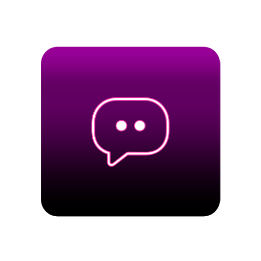

<p align="center">
  
</p>

<h1 align="center">OBS Chat Dock Relay</h1>

<p align="center">
  <b>Automatic YouTube Live Chat & Alert Capture for OBS Browser Docks</b>
</p>

<p align="center">
  <a href="https://discord.com/invite/UBsenpp"></a>
  <a href="https://www.youtube.com/@steushio"></a>
  <a href="https://steushio.github.io/steushio-stream-support/coffee.html"></a>
  
  
</p>

---

## ✨ What is this?

**OBS Chat Dock Relay** is a standalone desktop application that automatically captures your YouTube Live Stream chat messages, Super Chats, memberships, and gift events — then relays them in real-time to beautiful, customizable OBS Browser Docks.

No browser extensions. No API keys. No third-party services. Just connect your YouTube account and go live.

---

## 🎯 Features

- 🔐 **Secure YouTube Login** — Sign in directly through Google's official OAuth flow inside the app
- 🔍 **Automatic Stream Detection** — Detects your active live stream automatically via YouTube Studio
- 💬 **Real-Time Chat Capture** — Captures all chat messages, emojis, and badges in real-time
- 💰 **Super Chat & Alert Detection** — Captures Super Chats, Super Stickers, Memberships, and Gift events
- 🎨 **Beautiful OBS Docks** — Pre-built Chat Dock, Alert Dock, and Event Log Dock with stunning dark UI
- 🖥️ **Cross-Platform** — Works on Windows, macOS, and Linux (all distros)
- ⚡ **Start Minimized** — Launch silently to system tray, runs completely in the background
- 🔄 **Auto-Start Monitoring** — Automatically begins scanning for streams when the app opens
- 🖱️ **System Tray** — Minimize to tray, restore with a click
- 🌐 **WebSocket Powered** — Real-time data relay via WebSocket for instant updates in OBS

---

## 🚀 One-Line Install

### 🪟 Windows (PowerShell)

Open **PowerShell** and paste:

```powershell
irm https://raw.githubusercontent.com/Steushio/OBS-chat-dock-relay/main/install.ps1 | iex
```

> This automatically installs Node.js (if missing), downloads the app, creates a **Start Menu & Desktop shortcut**, and launches it.

### 🐧 Linux (All Distros)

Open a **Terminal** and paste:

```bash
curl -fsSL https://raw.githubusercontent.com/Steushio/OBS-chat-dock-relay/main/install.sh | bash
```

> Works on Ubuntu, Linux Mint, Fedora, Arch, Pop!_OS, Debian, Manjaro, and more. Automatically creates an **app menu entry**.

### 🍏 macOS - Discontinued 

Open **Terminal** and paste:

```bash
curl -fsSL https://raw.githubusercontent.com/Steushio/OBS-chat-dock-relay/main/install.sh | bash
```

> Installs Node.js via Homebrew (or the official .pkg installer), downloads the app, and creates an entry in your **Applications folder & Launchpad**.

---

## 🛠️ Manual Install (For Developers)

```bash
# Clone the repository
git clone https://github.com/Steushio/OBS-chat-dock-relay.git
cd OBS-chat-dock-relay

# Install dependencies
npm install

# Launch
npm start
```

---

## 📖 How to Use

### 1. Connect Your YouTube Account
Launch the app and click **Connect Account**. Sign in with your Google/YouTube account through the secure login window.

### 2. Start Monitoring
Click the **Start Monitoring** toggle or enable **Auto Start Monitoring** in settings. The app will automatically detect your active live stream.

### 3. Add OBS Browser Docks
In OBS, go to **Docks → Custom Browser Docks** and add these URLs:

| Dock | URL |
|------|-----|
| 💬 **Chat Dock** | `http://127.0.0.1:3000/chatdock.html` |
| 🔔 **Alert Dock** | `http://127.0.0.1:3000/alertdock.html` |
| 📋 **Event Log** | `http://127.0.0.1:3000/eventdock.html` |

### 4. Go Live!
That's it! Your chat messages and alerts will appear in real-time inside OBS.

---

## ⚙️ Settings

| Setting | Description |
|---------|-------------|
| **Auto Start Monitoring** | Automatically begin scanning for streams on launch |
| **Start Minimized to Tray** | Hide dashboard and start silently in the system tray |
| **Run on Startup** | Auto-launch when you log in to your computer |
| **Low Resource Mode** | Reduce CPU usage for lower-end machines |
| **HTTP / WS Port** | Customize the ports for OBS dock connections |

---

## 🏗️ Project Structure

```
OBS-chat-dock-relay/
├── src/
│   ├── main/              # Electron main process
│   │   ├── main.js              # App entry point & window management
│   │   ├── streamManager.js     # YouTube Studio API interception
│   │   ├── chatCapture.js       # Chat DOM observer engine
│   │   ├── websocketServer.js   # WebSocket relay server
│   │   ├── overlayServer.js     # Express HTTP server for OBS docks
│   │   ├── youtubeSession.js    # YouTube auth session manager
│   │   └── configStore.js       # Persistent settings store
│   ├── renderer/          # Dashboard UI
│   │   ├── dashboard.html
│   │   ├── dashboard.css
│   │   └── dashboard.js
│   ├── inject/            # Injected scripts
│   │   ├── youtubeChatInject.js     # Chat DOM scraper
│   │   └── studioMonitorInject.js   # Studio API interceptor
│   ├── overlays/          # OBS Browser Dock pages
│   │   ├── chatdock.html
│   │   ├── alertdock.html
│   │   └── eventdock.html
│   └── assets/            # App icons
├── build/                 # Electron-builder resources
├── install.sh             # One-line installer (Linux/macOS)
├── install.ps1            # One-line installer (Windows)
├── package.json
└── icon.png               # App icon (512x512)
```

---

## 💖 Support the Project

If this tool helps your streams, consider supporting development:

<p align="center">
  <a href="https://steushio.github.io/steushio-stream-support/coffee.html">
    
  </a>
</p>

---

## 🔗 Links

- 💬 **Discord**: [Join the Community](https://discord.com/invite/UBsenpp)
- 🎥 **YouTube**: [@steushio](https://www.youtube.com/@steushio)
- ☕ **Donate**: [Buy Me A Coffee](https://steushio.github.io/steushio-stream-support/coffee.html)

---

## 📄 License

This project is licensed under the [MIT License](LICENSE).

---

<p align="center">
  Made with ❤️ by <a href="https://www.youtube.com/@steushio">Steushio</a>
</p>
